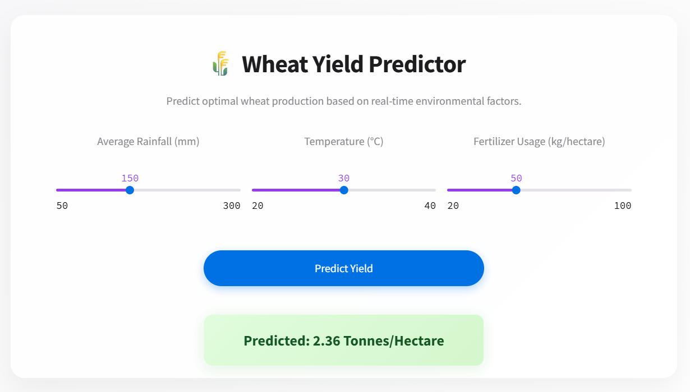

# 🌾 Wheat Yield Predictor

## 📖 Project Overview
This Deep Learning project predicts wheat crop yields based on three critical environmental factors: **Average Rainfall**, **Temperature**, and **Fertilizer Usage**. It utilizes deep learning to analyze agricultural data and output precise yield estimates in **Tonnes per Hectare**.

## 🚀 Tech Stack
- **Core**: Python 
- **Deep Learning**: PyTorch (ANN)
- **Data Processing**: Pandas, NumPy, Scikit-learn
- **Deployment**: Streamlit

## 🛠️ Implementation Workflow
This **Semester Project** was built in distinct phases:

### 1. 📊 Data Generation
I synthetically generated a dataset mimicking real-world agricultural patterns.
- **Inputs**: Rainfall (50-300mm), Temp (20-40°C), Fertilizer (20-100kg/ha).
- **Target**: Yield calculated via a linear custom formula with added Gaussian noise.

### 2. 🧹 Preprocessing
- **Loading**: Data ingested via Pandas.
- **Splitting**: Divided into Training (80%) and Testing (20%) sets.
- **Scaling**: Applied `StandardScaler` to normalize all features for optimal ANN performance.

### 3. 🧠 Model Architecture (ANN)
Built using `torch.nn`, the model features a feed-forward architecture:
- **Input Layer**: 3 Neurons (Rain, Temp, Fertilizer)
- **Hidden Layer 1**: 16 Neurons (ReLU Activation)
- **Hidden Layer 2**: 8 Neurons (ReLU Activation)
- **Output Layer**: 1 Neuron (Linear Regression Output)

### 4. 🏋️‍♂️ Training
- **Loss Function**: Mean Squared Error (MSE).
- **Optimizer**: Adam (Learning Rate: 0.01).
- **Epochs**: Trained for 100 iterations to minimize loss.

### 5. 🌐 Deployment
The final model is saved as `crop_yield.pth` and deployed via a responsive **Streamlit** web application featuring a modern Apple-style UI.



## 👨‍💻 Author
**Abdul Rauf Jatoi**  
*Semester Project - Artificial Neural Networks (ANN)*

---
### 🏃‍♂️ How to Run
```bash
streamlit run app.py
```
